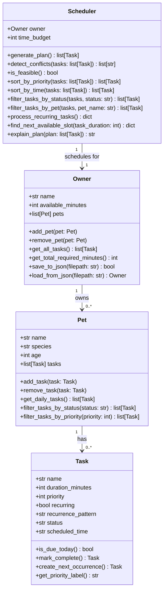
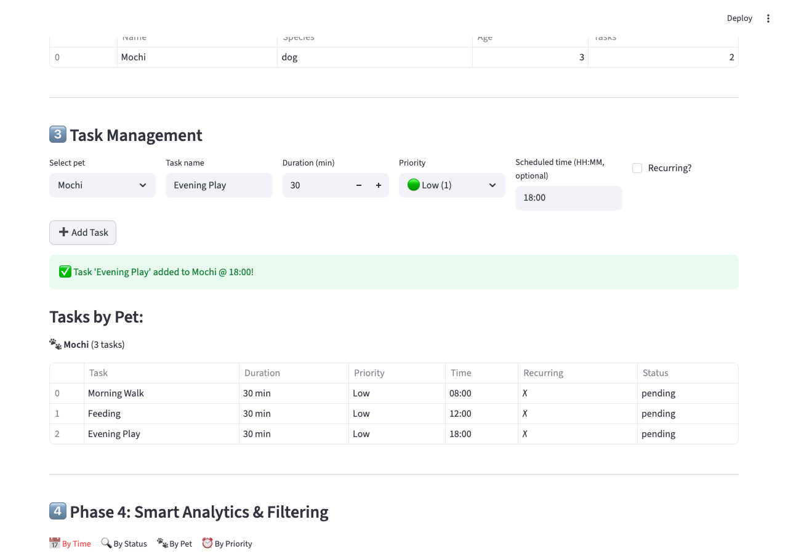

# PawPal+

Your pet's personal AI scheduler. PawPal+ combines smart priority-based scheduling with a Gemini-powered assistant that understands natural language, retrieves vetted pet care knowledge, and takes real actions — adding tasks, generating plans, and catching conflicts — all in one conversation.

## Features

- **Owner & Pet Setup** — Create an owner with a daily time budget, then register one or more pets
- **Task Management** — Add tasks per pet with name, duration, priority (1–5), optional scheduled time (HH:MM), and recurring flag
- **Smart Scheduling** — Greedy scheduler orders tasks by priority, then duration, fitting tasks within the owner's time budget
- **Conflict Detection** — Detects time-slot overlaps and budget overages with clear warning banners
- **Recurring Task Automation** — Completing a recurring task auto-creates the next occurrence
- **Data Persistence** — Save and load owner/pet/task data to `pawpal_data.json`
- **Priority Visualization** — Color-coded emoji indicators (🟢🟡🟠🔴⛔) and professional tabulate-formatted tables
- **AI Assistant** — Conversational chat powered by Gemini 2.5 Flash with RAG and agentic tool-calling

## AI Stack

| Component | Details |
|-----------|---------|
| **LLM** | Google Gemini 2.5 Flash (`gemini-2.5-flash`) |
| **RAG** | TF-IDF vectorized knowledge base (`pet_care_kb.txt`) covering dogs, cats, rabbits, and birds — top-3 chunks injected into every system prompt |
| **Agentic Tools** | Gemini function-calling executes real app actions: `list_pets`, `list_tasks`, `add_task`, `generate_schedule`, `check_conflicts` |
| **Loop limit** | Agent loops up to 5 iterations to prevent runaway API calls |

See [model_card.md](model_card.md) for full AI documentation including limitations and safeguards.

## Project Structure

```
PawPal+/
├── app.py                  # Main Streamlit entry point
├── pawpal_system.py        # Core data model: Task, Pet, Owner, Scheduler
├── utils.py                # Shared CSS, helpers, session state
├── agent_tools.py          # Gemini function-call tool definitions & executor
├── rag_engine.py           # TF-IDF RAG pipeline
├── pet_care_kb.txt         # Knowledge base for RAG
├── model_card.md           # AI model card
├── pages/
│   ├── 1_Owner_Pets.py     # Owner & pet setup
│   ├── 2_Tasks.py          # Task management
│   ├── 3_Schedule.py       # Schedule generation & conflict view
│   └── 4_AI_Assistant.py   # Gemini-powered chat assistant
├── voice_component/        # Custom voice input component
├── tests/
│   └── test_pawpal.py      # 34 unit tests (Task, Pet, Owner, Scheduler)
├── pawpal_data.json        # Persisted owner/pet/task data
└── requirements.txt
```

## System Design



## Setup

```bash
python -m venv .venv
source .venv/bin/activate  # Windows: .venv\Scripts\activate
pip install -r requirements.txt
```

Set your Gemini API key in a `.env` file:

```
GEMINI_API_KEY=your_key_here
```

### Run the app

```bash
streamlit run app.py
```

### Run tests

```bash
# All 34 tests
python -m pytest tests/test_pawpal.py -v

# By category
python -m pytest tests/test_pawpal.py::TestTask -v
python -m pytest tests/test_pawpal.py::TestPet -v
python -m pytest tests/test_pawpal.py::TestOwner -v
python -m pytest tests/test_pawpal.py::TestScheduler -v
python -m pytest tests/test_pawpal.py::TestPhase4Algorithms -v
```

## Demo

<a href="pawpal_screenshot.png" target="_blank"></a>

## Test Coverage

| Category | Tests |
|----------|-------|
| Task class | 5 |
| Pet class | 4 |
| Owner class | 4 |
| Scheduler core | 7 |
| Algorithms (sorting, filtering, recurrence, conflicts) | 14 |
| **Total** | **34 — all passing** |
